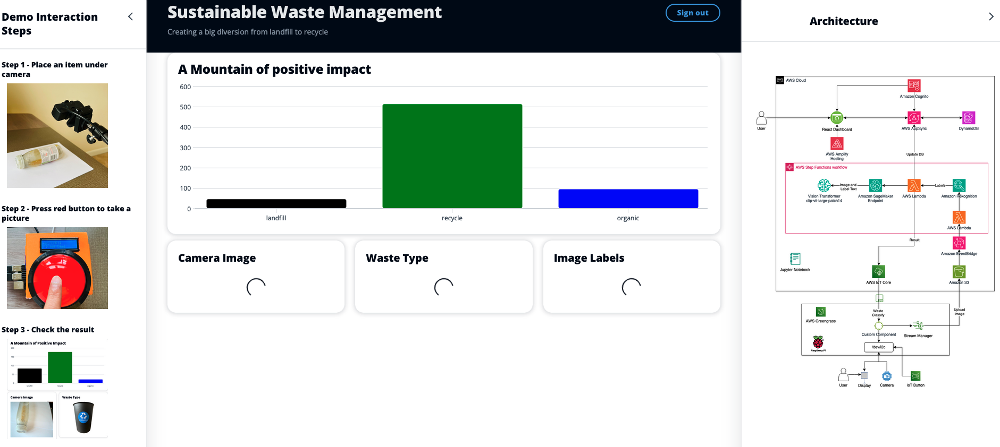
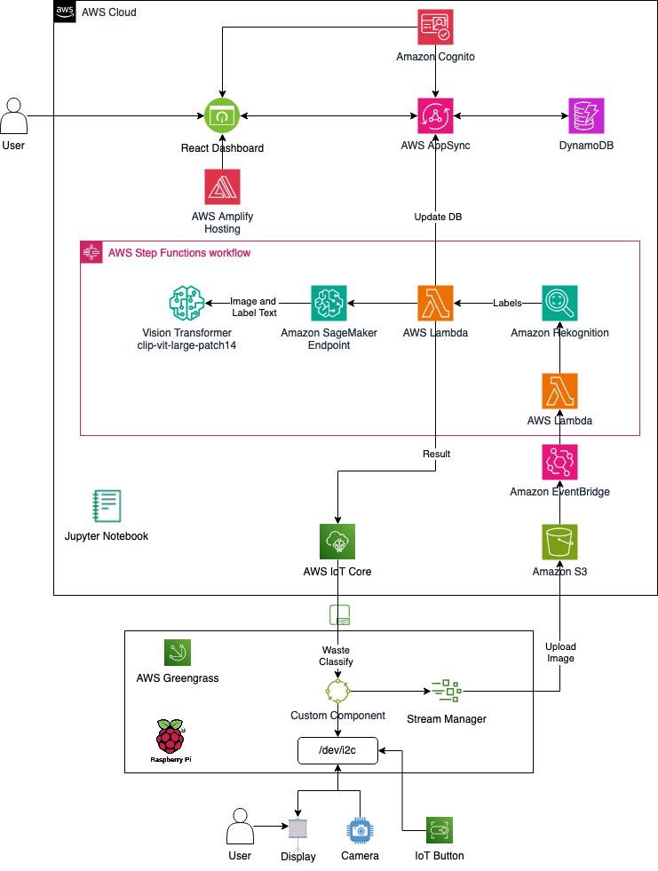
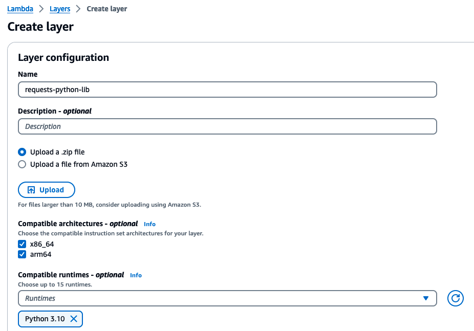
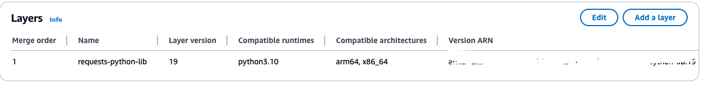

<h1 align="center">
AWS IoT AIML Waste Classification
<br>
   <a href="https://github.com/aws-samples/aws-iot-sagemaker-waste-classification/releases"></a>
   <a href="https://github.com/aws-samples/aws-iot-sagemaker-waste-classification/actions"></a>
</h1>

AWS IoT with zero shot waste image classification is an interactive demo of prompting CLIP models with a camera image and guiding a human to pick correct waste bin type.

<!--  -->

<p align="center">
  
</p>

# Motivation

There is no consistent, high-quality data about the amount of waste, the type and quality, where it is generated and where it goes. So with the use of sensors to collect data e.g photo capture of bin contents, demo flags content type in order to recycle and reusing materials to divert from landfills and also prevent problems with downstream recycling.

This is a simple fun demo to let people interact through big push button and trigger camera to take picture of waste item. Demo then uses AWS AI/ML services to process image to know the waste type and point to correct bin type on dashboard.

# User interactions

1) Place an item under camera
2) Push the color button
3) Review the waste type on screen

# Architecture


The key AWS services used in this architecture are:

- [Amazon SageMaker]("https://aws.amazon.com/sagemaker/") is used for hosting the clip model for zero shot image clasification.
- [Amazon Rekognition]("https://aws.amazon.com/rekognition/") is used to identify the contents in the image.
- [AWS IoT Greengrasss ]("https://aws.amazon.com/greengrass/") is used to build intelligent IoT device. In this case we use a Raspberry Pi device at the edge.
- [AWS Step functions]("https://aws.amazon.com/step-functions/") is used to orchistrate the computer vision workflow once image is uploaded to Amazon S3 bucket.
- [Amazon S3]("https://aws.amazon.com/s3/") is object storage built to retrieve any amount of data from anywhere. We use S3 to store the waste images and trigger the step function workflow. These images can also be used in the future for evaluation and fine-tuning of the models.
- [AWS Iot SDK]("https://docs.aws.amazon.com/iot/latest/developerguide/iot-sdks.html") is to help you build innovative IoT solutions with AWS IoT and your choice of hardware platforms.
- [Amazon DynamoDB]("https://aws.amazon.com/dynamodb/") is a serverless, NoSQL, fully managed database service. We use this to store waste classification result.
- [Amazon Cognito]("https://aws.amazon.com/cognito/") is a CIAM service that scales to million of users. We use this to secure portal dashboard access.
- [AWS Identity and Access Management]("https://aws.amazon.com/iam/") allows you to securely manage identities and access to AWS services and resources.
- [AWS Amplify Hosting]("https://aws.amazon.com/amplify/hosting/") is a fully managed CI/CD and hosting service for reliable static and server-side rendered apps. We use this to host dashboard app.
- [Cloudscape Design System]("https://cloudscape.design/) is an open source solution for building intuitive web applications. We use this to build dashboard app.

<!-- <p align="center">
  
</p> -->


# Prerequisites
1. Get the code
    ```bash
    git clone https://github.com/aws-samples/aws-iot-aiml-waste-classification
    cd aws-iot-aiml-waste-classification
    ```
2. [Complete pre-requisites for AWS ClI]("https://docs.aws.amazon.com/cli/latest/userguide/getting-started-prereqs.html")
3. [Complete pre-requisites for AWS SAM ClI]("https://docs.aws.amazon.com/serverless-application-model/latest/developerguide/prerequisites.html")
3. [Install aws cli by following AWS documentation]("https://docs.aws.amazon.com/cli/latest/userguide/getting-started-install.html")
3. [Install aws sam cli by following AWS documentation]("https://docs.aws.amazon.com/serverless-application-model/latest/developerguide/install-sam-cli.html")


### Deploy CLIP model
1. Login to your AWS account and create SageMaker notebook instance by [following instruction]("https://docs.aws.amazon.com/sagemaker/latest/dg/gs-setup-working-env.html")
2. Once notebook instance is setup, open Jupyter Lab by selecting the link on Notebook instance console.
3. Upload jupyter-notebook/img-classifier.ipynb file
4. Run each cell in sequence to deploy the CLIP model from huggingface.
5. Once model is deployed, note down the inference endpoint name from Inference/Endpoints section in Amazon SageMaker console.

### Create S3 Bucket
1. Create a S3 bucket and note the name.

# Deploy Solution
1. Upload the edge camera application to S3 bucket
```bash
aws s3 cp ./cloud/pi s3://solution-repo-eu-west-1/greengrass-app-components --recursive
```
2. Deploy cloud infrastructure
```bash
sam deploy \
         --stack-name <Stack Name> \
         --template-file cloud/cfn/main.yaml \
         --region <AWS Region> \
         --no-execute-changeset \
         --capabilities CAPABILITY_NAMED_IAM CAPABILITY_AUTO_EXPAND \
         --s3-bucket <S3 Bucket Name> \
         --parameter-overrides \
           ArtefactsBucketName=<S3 Bucket Name>  BucketName=<S3 Bucket Name> SageMakerInferenceEndpointName=<Model inference endpoint name>

Note down below values from above deployment for ui deployment configuration
    "aws_appsync_graphqlEndpoint",
    "aws_cognito_identity_pool_id",
    "aws_user_files_s3_bucket",
    "aws_user_pools_id",
    "aws_user_pools_web_client_id"
```


3. Create Amazon Lambda Layer and attach to Lambda function created by previous step.

  a. Download [Python request package that is compatible with Python version 3.10](https://pypi.org/project/requests/).

  b. Prepare zip of the request package locally where you downloaded it

  c. Create [Amazon Lambda Layer](https://docs.aws.amazon.com/lambda/latest/dg/creating-deleting-layers.html)

 

d. Select Lambda service and open Lambda function containing name "S3 event handler". Scroll down to bottom and add layer which you created in previous step.




# Build AWS Greengrass package for pi

1. Run below command to prepare package on your laptop or PI. Please make sure that you have installed AWS CLI v2 with access to your
AWS account.
  For this use case, I execute on my laptop to create package in build directory. You can then copy
  package on your IoT gateway (e.g., Raspberry Pi). The below script performs following steps.
  1. Create build directory
  2. Download AWS CA
  3. Download claim certificates from AWS Secrets Manager
  4. Download AWS IoT Greengrass and fleeting provisioning plugin
  5. Get the endpoints and fleet provisioning template for AWS IoT Core
  6. Prepare config.yml.
  7. Prepare Greengrass start up command.
  8. Change execution permission

```bash
chmod 755 edge/ci/prepare-rpi-deploy-pkg.sh
edge/ci/prepare-rpi-deploy-pkg.sh <Stack Name given in step 2> <AWS_REGION>
```
2. Copy build directory to Pi either doing ssh to pi or using usb drive.

# Deply the solution to Pi
Once the resources are set up on AWS cloud, please deploy AWS greengrass and application on your IoT gateway i.e. Raspberry PI for testing E2E solution. 
Please refer the steps [Deploy AWS IoT Greengrass on IoT Gateway](docs/aws_iot_greengrass_setup.md). In the instruction section "Test remote application deployment", 
edge app name appears as "monitor_wastebin_app". In this deployment, it appears "com.rpicam.detect".

2. After you successfully execute above tests, then check logs files for successful deployment and connection to AWS IoT core
```bash
sudo cd /v2/greengrass/logs
tail -100f greegrass.logs
```
# Configure UI

1. Edit app/src/aws-exports file and replace the values of below config variables by referring to the infrastructure details from step 2 in Deploy Solution section above.
```bash
aws_appsync_graphqlEndpoint
aws_cognito_identity_pool_id
aws_user_files_s3_bucket
aws_user_pools_id
aws_user_pools_web_client_id
```
2. Create user in Amazon Cognito.

Open Amazon Cognito in AWS console and locate user pool created something like "UserPool-xxx". Under Users tab, select create user and follow the steps to setup your account for UI.

# Build UI package

```bash
cd ./app
npm install
npm run build
```
Go to dist folder under app folder and manually select all files and create a zip file. You can rename it as ui.zip

# Deploy App using AWS Amplify hosting
1. Login to AWS console and select AWS Amplify service
2. Select host web app in new app dropdown button
3. Choose "Deploy without git provider" under Amplify hosting and select continue button
4. Give name to you webapp, then upload ui.zip file from app/dist folder and select "Save and deploy" button
5. Use the app url generated under domain field to launch it and follow the steps to login using user created in previous section.

# Local Development
See the [Local Development](docs/LOCAL_DEVELOPMENT.md) guide to get a copy of the project up and running on your local machine for development and testing purposes.

# Clean up

To avoid incurring future charges, please clean up the resources created.

To make cloud formation stack delete successfully, please carry out below steps first. Otherwise, stack deletion might fail.
1.	Please delete all the contents from the S3 bucket that was created by cloud formation script to upload sensor readings
2.	On AWS IoT Core Console, choose Things option under Manage section. Then press DemoWasteBin thing link.
3.	Choose "**Certificates**" tab. Then choose each certificate and press "**detach**" button.
4.	Follow step 3 by choosing "**Certificates**" option under "**Secure**" section
5.	Finally "**Deactivate**" and "**Delete**" all certificates one by one selecting Deactivate and Delete option from "**Actions**" drop down under "**Secure**" section.

### Remove the stack:
```bash
sam delete <stack name>
```
### Remove Amplify hosting
Open AWS Amplify in AWS console and select "delete app" action for your amplify hosting.

# BOM

- Raspberry Pi 4 Model B Starter Kit - https://thepihut.com/products/raspberry-pi-starter-kit?variant=20336446079038

- Web camera - https://www.amazon.co.uk/gp/product/B08H1L41KF/ref=ppx_yo_dt_b_asin_title_o02_s00?ie=UTF8&psc=1

- RGB 16x2 LCD Display (I2C, 3.3V/5V) - https://thepihut.com/products/rgb-16x2-i2c-lcd-display-3-3v-5v?variant=39862439444675

- Massive Arcade Button with LED - 100mm Red https://thepihut.com/products/massive-arcade-button-with-led-100mm-red?variant=27739243281

- Button wires - https://thepihut.com/products/arcade-button-and-switch-quick-connect-wires-0-25-10-pack


For additiona PI build instructions - please refer [here](https://github.com/aws-samples/amazon-bedrock-ai-karaoke/tree/main#build-instructions)


# Security
See [CONTRIBUTING](CONTRIBUTING.md#security-issue-notifications) for more information.

# License
This library is licensed under the MIT-0 License. See the LICENSE file.