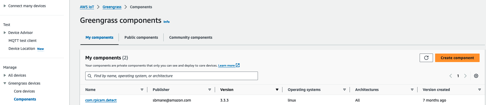

# Deploy AWS IoT Greengrass on IoT Gateway
Now that we have setup all the required resources in AWS account on cloud, we can prepare
package to install AWS IoT Greengrass core software with AWS IoT fleet provisioning.
To prepare package, all the steps are part of this [script](../edge/ci/prepare-rpi-deploy-pkg.sh). You can execute this script on IoT device
gateway or your computer. Please make sure that you have installed [AWS CLI](https://docs.aws.amazon.com/cli/latest/userguide/getting-started-install.html) v2 with access to your
AWS account.

For this use case, I execute on my laptop to create package in build directory. You can then copy
package on your IoT gateway (e.g., Raspberry Pi). The script performs below steps.

1. Create build directory
mkdir build && cd build
2. Download AWS CA
3. Download claim certificates from AWS Secrets Manager
4. Download AWS IoT Greengrass and fleeting provisioning plugin
5. Get the endpoints and fleet provisioning template for AWS IoT Core
6. Prepare config.yml.
7. Prepare Greengrass start up command.
8. Change execution permission.

# Test the Solution

As we have configured Raspberry Pi with AWS IoT Greengrass core software along with automatic
fleet provision configuration, let us now run AWS IoT Greengrass service.
Test AWS IoT Greengrass device provisioning
1. Connect (ssh) to IoT Device gateway (e.g., Raspberry Pi) command line terminal and run
below command to start AWS IoT Greengrass service to auto provision authenticate and
establish connection to AWS IoT Core.

```bash
sudo build/fleet_provision.sh
```

2. On AWS IoT Core Console, expand the Greengrass section from the left panel and choose
Core Devices option to verify the state of device. The device status should appear healthy as
below.


If device does not appear as healthy, then please check Greengrass service log for any errors
under /greengrass/v2/logs folder and follow [troubleshooting documentation](https://docs.aws.amazon.com/greengrass/v2/developerguide/troubleshooting.html).

# Test remote application deployment
1. Under Greengrass section, choose Component option for edge application deployment and
it should show private custom component as below. This custom component is already
hosted in Amazon S3 repository along with CloudFormation script and made ready for
deployment. However, for reference purpose, it is available on GitHub. To deploy this
application, please choose com.rpicam.detect app. Refer the procedures in the diagram
below.



2. Verify details version 3.3.3 and choose deploy button.


3. On deployment stage, select create new deployment option


4. On specify target page, select core device as target and enter the name of core device from
step 2 in section Test Greengrass device provisioning. For the rest of fields, follow the
instruction on page
5. On select component page, please select below components (My components and public
components) as shown screen shot.


6. Finally check component configuration and select Next button. Then on Configure advanced
settings section, only choose Next button and move to Review stage. On Review stage,
choose deploy button to finish deployment.


7. Please note that if you are redeploying same component, then please select modified
component and select “Configure component” button in the top right corner. Then in the
“Configuration to merge” section as shown in screen shot, please enter some text e.g.,
“deployment7”.


8. Now that application component deployment is completed, check the Greengrass logs on
Raspberry Pi to verify the deployed application is not terminated because of any errors like
permission issue etc.
a. Troubleshoot : If you observe greengrass service failed to download the custom
component artifacts from the Amazon S3 bucket because device name, certificate
path cannot be empty, then stop and start greengrass service as below and repeat 1
to 6 steps again to redeploy application.


```bash
sudo systemctl stop greengrass.service
sudo systemctl start greengrass.service
```

9. On AWS IoT Greengrass console, deployment should appear as completed

